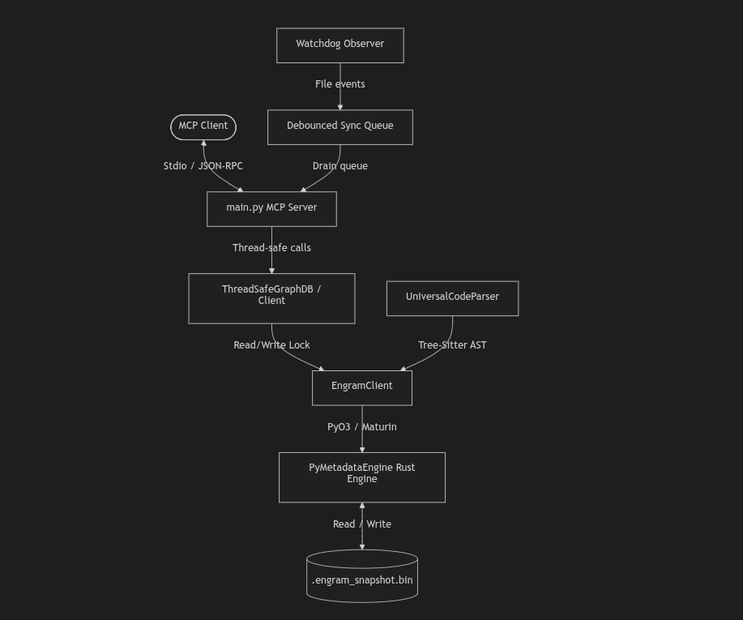

# 🦠 Cordyceps Search

**Cordyceps Search** is a high-performance codebase semantic search, dependency tracking, and AST-aware refactoring engine. It is packaged as an MCP (Model Context Protocol) server designed to empower developer agents with the structural understanding and refactoring capabilities of a mature IDE.

By combining the blazing speed of a Rust-native CSR (Compressed Sparse Row) graph engine with the precision of `tree-sitter` AST parsers, Cordyceps Search enables instant semantic discovery, caller/callee blast radius auditing, and cross-file refactoring.

---

## 🚀 Key Features

* **Zero-Copy CSR Graph Engine**: Backed by a high-performance Rust core (`engramdb`) for microsecond-level graph traversals and memory efficiency.
* **Multi-Language AST Parsing**: Full structural extraction (classes, methods, functions, calls, returns, docstrings) for Python, JavaScript, JSX, TypeScript, and TSX using `tree-sitter`.
* **Cross-Boundary API Tracking**: Traces connections between frontend HTTP requests (`fetch`, `axios`) and backend endpoints (Django, Flask, FastAPI).
* **AST-Aware Safe Refactoring**: Supports syntax-validated node edits, structured node creation, and AST-aware renaming with cross-file reference propagation.
* **Watchdog-Driven Real-Time Sync**: Automatically detects file additions, modifications, and deletions in the workspace, debouncing events, and keeping the code graph dynamically updated.
* **Thread-Safe RW Concurrency**: Protected by a read-write lock mechanism to ensure safe multi-threaded reads while keeping the unsendable Rust engine execution serial.

---

## Supported Languages

Indexed via `tree-sitter`. Adding a language = drop a YAML config in `src/database/parser/languages/` — no code changes required. Other files are ingested as body-only `File` nodes (searchable, no AST).

| Language | Extensions | Parser | Notes |
|---|---|---|---|
| Python | `.py` | `tree_sitter_python` | Full contextual resolution — imports/aliases, lexical scopes, receiver types, `self`/`cls`/`super()` MRO, shadowed locals, union annotations |
| JavaScript | `.js` | `tree_sitter_javascript` | Functions, classes, calls, imports/exports, routes, HTTP calls |
| JavaScript (JSX) | `.jsx` | `tree_sitter_javascript` | Same as JS + JSX components |
| TypeScript | `.ts` | `tree_sitter_typescript` | Types, interfaces, generics, inheritance |
| TypeScript (TSX) | `.tsx` | `tree_sitter_typescript` | Same as TS + JSX/TSX components |

Body-only file nodes (no AST, searchable as files): `.json`, `.md`, `.html`, `.css`, `.yml`, `.yaml`, `.toml`, `.txt`, `.sql`.

Excluded from indexing: `node_modules`, `venv`, `.venv`, `__pycache__`, `target`, `dist`, `build`, `migrations`, `.git`, `.idea`, `.vscode`, `coverage`, `.next`, `.nuxt`, `fixtures`, `test_fixtures`, `test_data` and any dotfile dirs. Extend via `CORDYCEPS_EXCLUDE` env var (comma-separated).

---

## 🏗️ Architecture



* **`main.py`**: The stdio transport server entrypoint using `FastMCP`.
* **`src/database/`**: Core client interface wrapping the Rust engine, managing Django ORM/URL resolutions, and enforcing read-write thread safety.
* **`src/database/parser/`**: Language-specific grammar configurations and the `UniversalCodeParser` that walks tree-sitter ASTs.
* **`src/watcher/`**: File system events monitor built on `watchdog` to coordinate incremental rebuilds.
* **`src/services/`**: Logical business operations supporting graph queries, fuzzy searches, and AST modification edits.

---

## Getting Started

### Prerequisites

* Python `>= 3.11`
* [uv](https://github.com/astral-sh/uv) (Fast Python Package Installer)
* Rust toolchain (only for local `engramedb` development)

### Installation

```bash
git clone https://github.com/ghassenTn/cordyceps_mcp.git
cd cordyceps_mcp
uv sync --python 3.11
```

This installs `engramedb` from PyPI as declared in `pyproject.toml`. No local engine checkout required for normal use.

### Local Development (engine + MCP)

For editable installs where MCP uses a sibling `engramedb` checkout:

```bash
git clone https://github.com/ghassenTn/cordyceps_mcp.git
git clone https://github.com/ghassenTn/engramedb.git
# layout: cordyceps_mcp/  ../engramedb/
cd cordyceps_mcp
uv sync --python 3.11  # uses [tool.uv.sources] path = "../engramedb"
```

Engine development:

```bash
cd ../engramedb
maturin develop --release
```

---

## 📂 Command Guide

Run the following commands using the `uv` toolchain:

| Command | Description |
| :--- | :--- |
| `uv run python main.py [workspace_path]` | Starts the MCP server (stdio transport). Defaults to current directory. |
| `uv run python -m pytest` | Runs the full test suite (89 tests passing). |
| `uv run python -m pytest -m unit` | Runs only parser and YAML serialization unit tests. |
| `uv run python -m pytest -m integration` | Runs graph database and editor integration tests. |
| `uv run python -m pytest -xvs test_ast_parser.py` | Fast feedback loop for debugging parser tests. |

---

## 🔌 MCP Tools Provided

### 1. `search_nodes`
Fuzzy searches the metadata index.
* **Parameters**:
  * `keyword` (str): Search term.
  * `type_filter` (str, optional): Restricts results to `function`, `class`, `file`, or `folder`.
  * `max_results` (int, default: 50): Cap on results.

### 2. `analyse_impact`
Maps the callers or callees of a specific code node at a given BFS depth.
* **Parameters**:
  * `node_id` (str): Unique node identifier in format `file_path:NodeName`.
  * `direction` (str, default: `"callers"`): Direction of traversal (`"callers"` or `"callees"`).
  * `depth` (int, default: `0`): BFS level depth (0 = unlimited).

### 3. `trace_business_flow`
Traces logical workflows across modules starting from a given node.
* **Parameters**:
  * `start_node` (str): Unique node identifier to start tracing from.
  * `workflow` (str, default: `"Business Flow"`): Name/label of the workflow.
  * `exclude_framework` (bool, default: `true`): Exclude framework/library calls from trace.
  * `business_only` (bool, default: `false`): Restrict trace to business-only domain components.
  * `max_depth` (int, default: `5`): Maximum traversal depth.
  * `show_module_boundaries` (bool, default: `true`): Highlights when the flow crosses module boundaries.
  * `deduplicate_paths` (bool, default: `true`): Remove redundant duplicate execution paths.

### 4. `trace_frontend_backend`
Traces connections between frontend HTTP requests and backend Django endpoints.
* **Parameters**:
  * `api_endpoint` (str): The frontend API endpoint URL or backend URL pattern.
  * `include_components` (bool, default: `true`): Whether to include the UI component nodes in the trace.

### 5. `audit_tenant_isolation`
Audits database and boundary separation to detect tenant isolation leaks.
* **Parameters**:
  * `module` (str, default: `"sales"`): The workspace module name to check.
  * `check_type` (str, default: `"comprehensive"`): Type of audit checklist.

---

## ✏️ Code Refactoring Services

The server includes internal services to execute safe editing of code nodes:
* **`edit_node`**: Replaces the source body of a class/function with automated base indentation matching and isolated preflight syntax checking.
* **`create_node`**: Appends classes or functions to files, guarding against project-wide naming collisions.
* **`rename_node`**: Performs AST-safe renames of code identifiers (ignoring comments/strings) and propagates the change across all caller files mapped in the graph.
* **`add_remove_imports`**: Inserts or removes import statements at the top of code files cleanly.

All edits generate safety backups (`.bak` files) before mutating target code.

---

## 🧪 Testing

The test coverage covers parsing, synchronization safety, and graph queries. To run tests, use:
```bash
uv run python -m pytest
```
All tests use pytest fixtures defined in `conftest.py` with custom thread-safety and environment isolated markers.

---

## 📄 License

This project is licensed under the MIT License - see the LICENSE file for details.
